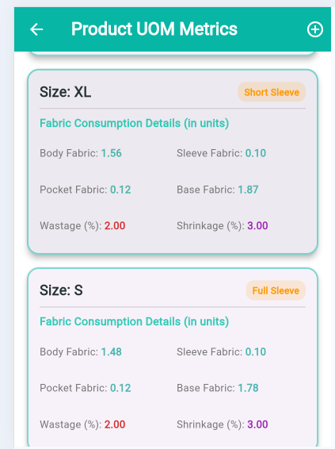

# 🚀 Admin Module: HR Management System

This README provides an overview of the **Admin Module** for the Human Resources (HR) Management System, based on the provided UI screenshots. This module serves as the central control panel for managing the organization's structure, employee data, attendance records, and leave requests.

---

## 🌟 Key Features

The Admin Module is designed to give administrators comprehensive control over the HR system. The primary functionalities include:

* **Dashboard & Navigation:** Provides quick access to all features and a system overview.
* **User Profile Management:** Ability to view and update the administrator's profile details.
* **Organizational Structure:** Management of organizational departments and employee designations.
* **Daily Attendance Logging:** Monitoring and reviewing daily employee check-in and check-out records.
* **Active Employee Directory:** Viewing the current list of active employees and their details.
* **Leave Management:** Reviewing, approving, or rejecting employee leave applications.

---

## 🖼️ Module Screenshots Overview

The paths have been updated to reflect the structure: `screenshots/admin/filename.PNG`.

| Screenshot | File Name | Image Link | Description |
| :--- | :--- | :--- | :--- |
| **Dashboard** | `admin dashboard.PNG` |  | The main view with a sidebar for easy navigation to all sub-modules. |
| **Admin Profile** | `admin profile.PNG` |  | The screen for viewing or updating the administrator's personal and account information. |
| **Departments** | `all departments.PNG` |  | Lists all organizational departments (e.g., Production, Marketing). |
| **Daily Attendance** | `attendance.PNG` |  | Shows records of daily employee attendance (e.g., check-in/check-out). |
| **Designations** | `designations.PNG` |  | Lists all job roles or titles within the organization. |
| **Employee List** | `employee list.PNG` |  | A directory of all active employees, including basic details. |
| **Leave Report** | `leave.PNG` |  | Displays reports or a queue of pending/approved employee leave applications. |

---

## ⚙️ Technical Structure

The Admin Module typically integrates with the following backend entities and APIs:

| Data Entity | Primary Management Screens | Key Operations (CRUD) |
| :--- | :--- | :--- |
| **Department** | `all departments.PNG` | Create, Read, Update, Delete organizational units. |
| **Designation** | `designations.PNG` | CRUD job titles/roles. |
| **Employee** | `employee list.PNG` | Read employee profiles, basic management (e.g., activation/deactivation). |
| **Attendance** | `attendance.PNG` | Read/Review daily check-in/out records. |
| **Leave Request** | `leave.PNG` | Read, Approve, Reject leave requests. |

---

## 🔒 Access and Security

This module is restricted to users with **Admin** privileges. Access control ensures only authorized personnel can view and modify organizational and employee data.

---

 <!-- merchandiser section -->

 # 👗 Merchandiser Module: Garments Management System (RMG)

This README provides a complete overview of the **Merchandiser Module** based on the provided UI screenshots. This module is designed to manage the merchandising workflow, including buyers, orders, BOM (Bill of Materials), raw material calculations, and UOM (Unit of Measurement) management.

---

## 🌟 Key Features

The Merchandiser Module offers end‑to‑end control over merchandising operations:

* **Buyer Management:** Add, view, and manage buyer profiles.
* **Order Management:** Create and track orders, view detailed breakdowns, and search orders.
* **BOM (Bill of Materials):** Generate, edit, and view BOM by style code or as a list.
* **Raw Material Calculations:** Auto‑calculate required materials for production based on style and order.
* **UOM Management:** Manage units of measurement used across materials and orders.
* **Merchandiser Dashboard & Profile:** Overview of tasks with profile viewing options.

---

## 🖼️ Module Screenshots Overview

Below is the screenshot documentation with paths: `screenshots/merchandiser/filename.PNG`.

| Screenshot                             | File Name                                  | Preview                                                                                      | Description                                        |
| :------------------------------------- | :----------------------------------------- | :------------------------------------------------------------------------------------------- | :------------------------------------------------- |
| **Add Buyer (Form 1)**                 | `add buyer 1.PNG`                          |                                  | Basic buyer information input form.                |
| **Add Buyer (Form 2)**                 | `add buyer 2.PNG`                          |                                  | Additional buyer details submission screen.        |
| **BOM Details by Style Code**          | `BOM details by StyleCode.PNG`             |             | BOM breakdown for a specific style code.           |
| **BOM List**                           | `BOM list.PNG`                             |                                          | List of all generated BOMs.                        |
| **Buyer List**                         | `buyer list.PNG`                           |                                      | Displays all registered buyers.                    |
| **Merchandiser Dashboard**             | `merchandiser dashboard.PNG`               |                           | Quick access panel for all merchandising features. |
| **Merchandiser Profile**               | `merchandiser profile.PNG`                 |                               | Shows merchandiser personal information.           |
| **Order Details (1)**                  | `order details 1.PNG`                      |                                  | Overview of an order with key attributes.          |
| **Order Details (2)**                  | `order details 2.PNG`                      |                                  | Extended view of order specifications.             |
| **Order List (Search View)**           | `order list by searching.PNG`              |                   | Orders filtered by search criteria.                |
| **Order List (Full List)**             | `order list.PNG`                           |                                      | Complete list of all orders.                       |
| **Raw Materials Calculation (Search)** | `raw materials calculations by search.PNG` |  | Search and calculate required raw materials.       |
| **Raw Materials Calculation (List)**   | `raw materials calculations list.PNG`      |           | List of all previously calculated raw materials.   |
| **UOM List**                           | `UOM.PNG`                                  |                                                      | Displays all unit of measurement items.            |

---

## ⚙️ Technical Structure

Below is the structural mapping of module entities and primary operations:

| Entity            | Related Screens                     | Main Operations                    |
| :---------------- | :---------------------------------- | :--------------------------------- |
| **Buyer**         | add buyer 1 & 2, buyer list         | Add, Update, View buyers.          |
| **Order**         | order list, order details 1 & 2     | Create, View, Search orders.       |
| **BOM**           | BOM details by style code, BOM list | Generate, View, Update BOM.        |
| **Raw Materials** | calculation screens                 | Auto‑calculate required materials. |
| **UOM**           | UOM list                            | Manage types of measurement units. |

---

## 🔒 Access & Permissions

Only authorized **Merchandisers** can access this module. Data is restricted and securely handled using role‑based routing and backend validation.

---

## 📌 Notes

This documentation is based entirely on provided UI screenshots and reflects the Merchandising workflow of a Garments Management System (RMG).

---
