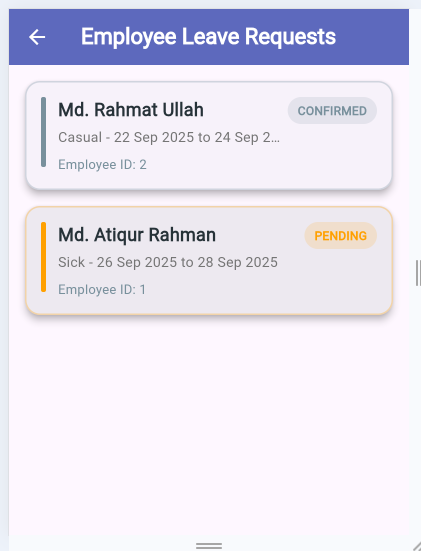

# 🚀 Admin Module: HR Management System

This README provides an overview of the **Admin Module** for the Human Resources (HR) Management System, based on the provided UI screenshots. This module serves as the central control panel for managing the organization's structure, employee data, attendance records, and leave requests.

---

## 🌟 Key Features

The Admin Module is designed to give administrators comprehensive control over the HR system. The primary functionalities include:

* **Dashboard & Navigation:** Provides quick access to all features and a system overview.
* **User Profile Management:** Ability to view and update the administrator's profile details.
* **Organizational Structure:** Management of organizational departments and employee designations.
* **Daily Attendance Logging:** Monitoring and reviewing daily employee check-in and check-out records.
* **Active Employee Directory:** Viewing the current list of active employees and their details.
* **Leave Management:** Reviewing, approving, or rejecting employee leave applications.

---

## 🖼️ Module Screenshots Overview

The paths have been updated to reflect the structure: `screenshots/admin/filename.PNG`.

| Screenshot | File Name | Image Link | Description |
| :--- | :--- | :--- | :--- |
| **Dashboard** | `admin dashboard.PNG` |  | The main view with a sidebar for easy navigation to all sub-modules. |
| **Admin Profile** | `admin profile.PNG` |  | The screen for viewing or updating the administrator's personal and account information. |
| **Departments** | `all departments.PNG` |  | Lists all organizational departments (e.g., Production, Marketing). |
| **Daily Attendance** | `attendance.PNG` |  | Shows records of daily employee attendance (e.g., check-in/check-out). |
| **Designations** | `designations.PNG` |  | Lists all job roles or titles within the organization. |
| **Employee List** | `employee list.PNG` |  | A directory of all active employees, including basic details. |
| **Leave Report** | `leave.PNG` |  | Displays reports or a queue of pending/approved employee leave applications. |

---

## ⚙️ Technical Structure

The Admin Module typically integrates with the following backend entities and APIs:

| Data Entity | Primary Management Screens | Key Operations (CRUD) |
| :--- | :--- | :--- |
| **Department** | `all departments.PNG` | Create, Read, Update, Delete organizational units. |
| **Designation** | `designations.PNG` | CRUD job titles/roles. |
| **Employee** | `employee list.PNG` | Read employee profiles, basic management (e.g., activation/deactivation). |
| **Attendance** | `attendance.PNG` | Read/Review daily check-in/out records. |
| **Leave Request** | `leave.PNG` | Read, Approve, Reject leave requests. |

---

## 🔒 Access and Security

This module is restricted to users with **Admin** privileges. Access control ensures only authorized personnel can view and modify organizational and employee data.

---

